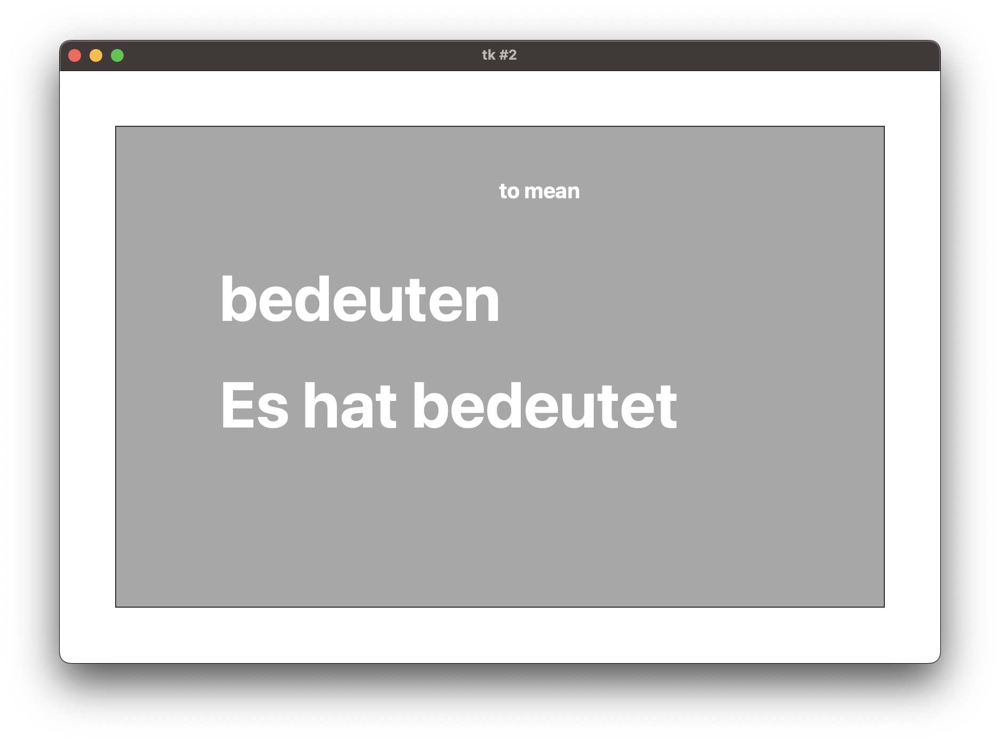

# ich_lerne_deutsch
This is a simple package for building German vocabulary. It implements several different exercises for recalling word definitions, noun genders, plural forms and Partizip 2 of verbs. 
The word lists are completely customisable and editable. For example, words can be added and deleted and the definitions can be put into your mother tongue. I have provided a few lists of A1 level nouns verbs and adjectives and adverbs. Much of this is borrowed from [here](https://github.com/patsytau/anki_german_a1_vocab). Thank you Patsy. There are bound to be errors here. Please be alert and report any mistakes.  

## Installation
### Install Ananconda
Install anaconda or miniconda from [here](https://www.anaconda.com/). The rest of the installation and running the app will require you to use either the computer terminal (on Mac/Linux) or the 'Anaconda prompt' on Windows. The Anaconda prompt will have been installed when you installed Anaconda.

### Install ich_lerne_deutsch 
Download the contents of the 'scripts' folder and download the the '.whl' file in the 'dist/' folder. You can of course download the whole repositiory if that is easier In the computer terminal (Mac/Linux) or Anaconda prompt (Windows) type the following
```
conda create -n ich_lerne_deutsch_env python=3.10
```
when prompted type 'y'. Then 

```
conda activate ich_lerne_deutsch_env
conda install pip
pip install "/Users/hmatth5/Documents/Projects/ich_lerne_deutsch/dist/ich_lerne_deutsch-0.1-py3-none-any.whl"
```
In the last line replace "/Users/....whl" with the path on your computer to the .whl file

## Building word lists
### Word lists as csv files
Word lists are expected in tab-delimited '.csv' files. Sprecific columns are expected, depending on the type of word (verb, noun, other). See the example word lists in 'csv_word_lists/'. When making your own word list make sure 1) the column headers remain the same as in the examples 2) you save the file as '.csv' with tab as the column delimiter. 

Word lists can be made in a spreadsheet by hand in [Libre Office](https://www.libreoffice.org/)(this software is free) or [Micrososft Excel](https://www.microsoft.com/en-us/microsoft-365/excel).

### Converting word lists into training batches
The word lists in the .csv files must now be divided into batches for learning. To do this, locate where on your computer is the file from scripts/make_word_batches.p. In the computer terminal or Ananconda prompt type:
```
conda activate ich_lerne_deutsch_env
python "/Users/hmatth5/Documents/Projects/ich_lerne_deutsch/scripts/make_word_batches.py"
```
Replacing the path on the last line with the path on your computer to the file 'make_word_batches.py'.

You will see a dialog open, here you can select the '.csv' files containing your word lists (or those that come in the repository)


Press "Open". You will then see another dialog. Here enter the approximate number of words you want in each batch. 


Press "OK". You will then see another dialog prompting you to select a folder. 


Press "Choose". You should then find several files with a '.p' file extension. These contain the individual word batches. This file format is not human readable but will be used with the app.


## Running the app
### Launching the app
To run the app locate the file from 'scripts/launch_app.py'. In the computer terminal (Mac/Linux) or Anaconda prompt (Windows) type or copy:
```
conda activate ich_lerne_deutsch_env
python "/Users/hmatth5/Documents/Projects/ich_lerne_deutsch/scripts/launch_app.py"
```
Replacing the path on the last line with the path on your computer to the 'launch_app.py' file.

You will be prompted to select a word list from the '.p' files.


Then to select an exercise (see below)


### Exercises
#### Speicherkarten
This are traditional flash cards. A word from your list is shown with the definition and (if a Noun) the article and (if a verb) the hilfsverb and Partizip II missing. The idea is that you try to recall the information. You then click to see what was right answer. Below you can see example question and answer cards for each word type.

*Noun*


*Verb*



*Other*


#### Nomen Genus
This exercise is for recalling the gender of nouns. On each trial you will be shown a singular noun. You should select the correct article in nominative case. You can keep track of your progress with the progress bar at the top. This shows you what proportion of recent trials you answered correctly. When it reaches 100% you have correctly answered for each word five times in a row.


#### Was ist das Wort auf Deutsch?
#### Partizip II
#### Plural

